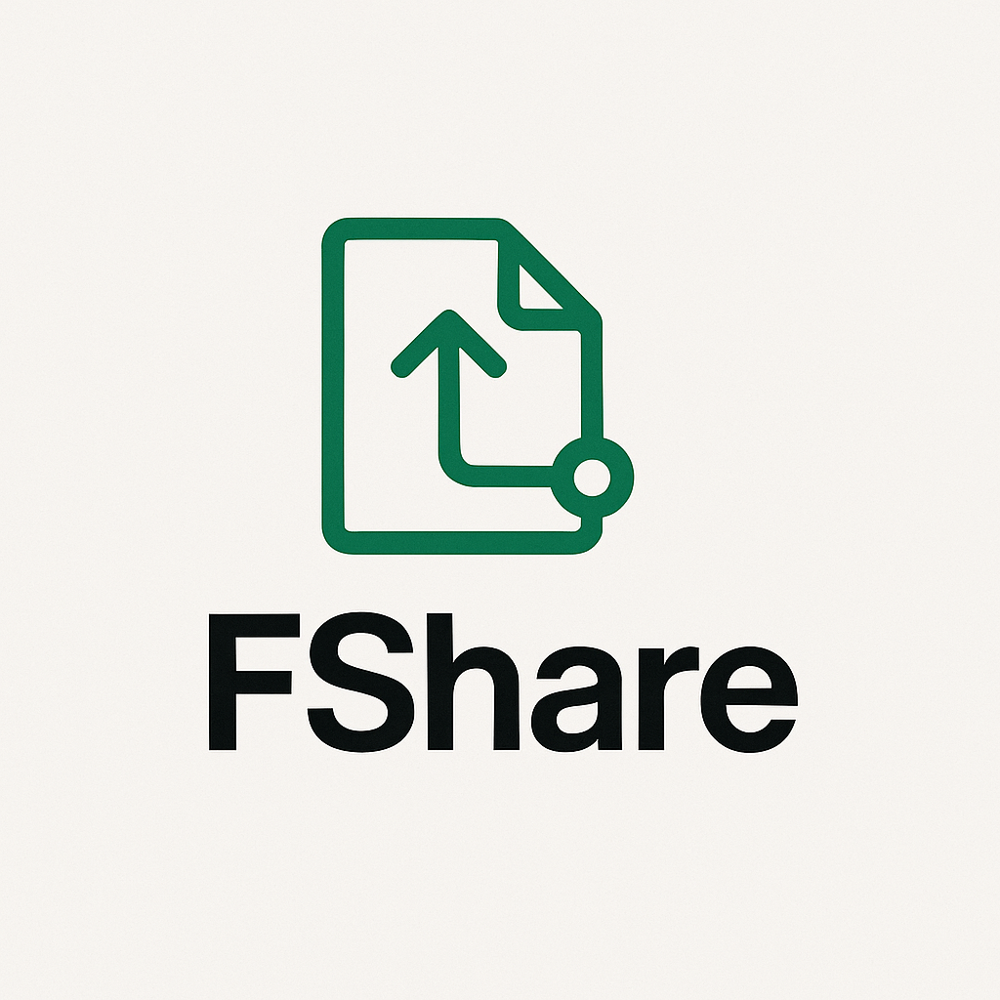

# 🚀 Fshare - Instant File Sharing Tool  

<p align="center">
  
</p>

**Fshare** is a powerful, open-source CLI tool designed to share files and directories instantly from your terminal to anywhere in the world. Built with Python, Flask, and Pinggy.io, it simplifies file sharing with just one command—no complex setup required.  

---

## 🚀 Key Features

- ⚡ **Instant Sharing**: Share files or folders with one command.
- ✅ No File Size Limits – Share large files without restrictions.
- 📁 **Multiple Files & Directories**: Send anything — single file, multiple files, or entire folders.
- 🌐 **Internet Ready**: Works beyond local networks using [Pinggy.io](https://pinggy.io) tunnels.
- 🗜️ **Automatic Compression**: When sharing multiple files or directories, Fshare automatically compresses them into a ZIP archive.
- 🧠 **Smart Interface**: Intuitive CLI with rich visuals using `Typer` and `Rich`.
- 🔒 **File Quality Preserved**: No downscaling or format conversion.
- 🐳 **Dockerized**: Fully containerized option with a bash wrapper for easy use.
- 🧩 **Modular & Maintainable Codebase**: Clean separation of backend, CLI, and tunneling logic.

---

---

## 🎯 **Why Choose Fshare?**  

| Feature        | Fshare | WeTransfer | Google Drive |  
|---------------|--------|------------|-------------|  
| **No Signup**  | ✅ Yes | ❌ No      | ❌ No        |  
| **No Limits**  | ✅ Yes | ❌ 2GB Max | ❌ 15GB Max  |  
| **Privacy**    | ✅ Full Control | ❌ Uploads Files | ❌ Uploads Files |  
| **Speed**      | ⚡ Direct Transfer | 🐢 Upload Required | 🐢 Upload Required |  

---

## 🛠 **Installation**  

### **Method 1: Using Docker (Recommended)**  

```bash
# Clone the repository  
git clone https://github.com/your-repo/fshare.git  

# Navigate to the project directory  
cd fshare  

# Build the Docker image  
docker build -t fshare-cli .  

# Run Fshare (alias for convenience)  
alias fshare='docker run -it --rm -v "$(pwd)":/data fshare-cli'  

# Share a file  
fshare myfile.pdf  
```

### **Method 2: Manual Setup (Python)**  

```bash
# Install dependencies  
pip install flask typer rich  

# Run directly  
python cli_app.py share myfile.pdf  
```

---

## 🚦 **Usage**  

### **Sharing a Single File**  
```bash
./fshare.sh document.pdf  
```  

### **Sharing Multiple Files**  
```bash
./fshare.sh file1.txt file2.jpg file3.pdf  
```  

### **Sharing a Directory**  
```bash
./fshare.sh any_folder
```  

### **Help Command**  
```bash
./fshare.sh --help  
```  

---

## 📌 **How It Works**  

1. **Local Server Setup** – Fshare starts a local Flask server to host your files.  
2. **Internet Exposure** – Uses Pinggy.io to create a public URL via SSH tunneling.  
3. **Secure & Temporary** – The link expires when you stop the server (CTRL+C).  
4. **Compression (if needed)** – Automatically zips multiple files/directories.  

---

## 🛡 **Security & Privacy**  

🔒 **No Uploads to Third-Party Servers** – Files stay on your machine.  
🔒 **No Permanent Storage** – Links expire when the session ends.  
🔒 **Local-Only by Default** – Internet exposure is opt-in.  

---

## 🤔 **FAQ**  

### ❓ **Is Fshare free?**  
✅ **Yes!** Fshare is completely free and open-source.  

### ❓ **Can I share large files (>1GB)?**  
✅ **Yes!** Unlike many cloud services, Fshare has no file size limits.  

### ❓ **How long do shared links last?**  
⏳ **Until you stop the server** (CTRL+C). No permanent storage.  

### ❓ **Does it work on Windows?**  
✅ **Yes**, via WSL (Windows Subsystem for Linux).  

---

## 📜 **License**  
MIT License – Free for personal and commercial use.  

---

## 🚀 **Contribute**  
Want to improve Fshare? Contributions are welcome!  

🔹 **Report Bugs** – Open an issue.  
🔹 **Suggest Features** – Submit a PR.  
🔹 **Star the Repo** – Show your support!  

📌 **GitHub**: [https://github.com/cyberytti/Fshare](https://github.com/cyberytti/Fshare)


